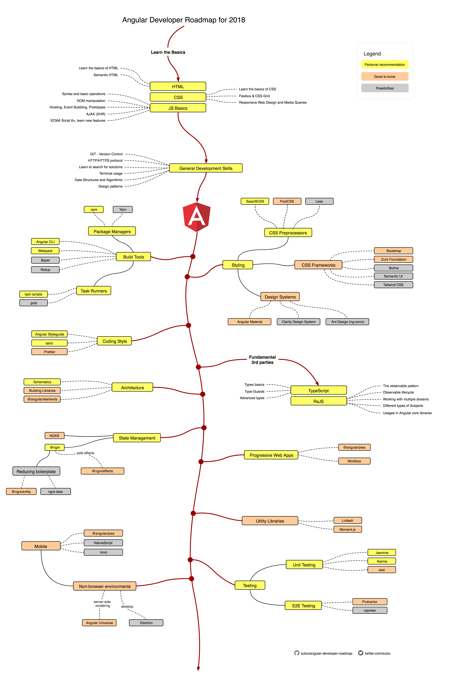

# Angular Developer Roadmap

This project aims to collect the most common / important concepts one should learn to become an Angular developer.
 
Inspired by ["Web Developer Roadmap"](https://github.com/kamranahmedse/developer-roadmap) and ["React Developer Roadmap"](https://github.com/adam-golab/react-developer-roadmap).

## Roadmap

## Download

Get a [PDF version](./angular-dev-roadmap.pdf).

## Topics covered + suggested resources

1.  The basics:
    - HTML
      - [marksheet.io](https://marksheet.io/)
      - [MDN on HTML](https://developer.mozilla.org/en-US/docs/Web/HTML)
    - CSS
      - [marksheet.io](https://marksheet.io/)
      - [MDN on CSS](https://developer.mozilla.org/en-US/docs/Web/CSS)
    - JavaScript
      - ["You Don't Know JS"](https://github.com/getify/You-Dont-Know-JS)
      - [NodeSchool.io](https://nodeschool.io/)
      - [ES6 Overview in 350 Bullet Points](https://ponyfoo.com/articles/es6)
1.  General Development Skills
    - GIT
      - ["Learn Git Branching"](https://learngitbranching.js.org/)
    - HTTP/HTTPS
    - Learn to search for solutions
    - Terminal usage
    - Data Structures and Algorithms
    - Design Patterns
1.  Build tools
    - Package Managers
      - [npm](https://www.npmjs.com/)
      - [Yarn](https://yarnpkg.com/lang/en/)
    - Angular CLI
      - [Angular CLI Wiki](https://github.com/angular/angular-cli/wiki)
    - [Bazel](https://bazel.build/)
    - [Rollup](https://rollupjs.org/guide/en)
    - Task runners
      - [npm scripts](https://medium.freecodecamp.org/introduction-to-npm-scripts-1dbb2ae01633)
      - [gulp](https://gulpjs.com/)
1.  Styling
    - CSS Preprocessors
      - [Sass/SCSS](https://sass-lang.com/guide)
      - [PostCSS](https://postcss.org/)
      - [Less](http://lesscss.org/)
    - CSS Frameworks
      - [Bootstrap](https://getbootstrap.com/)
      - [Zurb Foundation](https://foundation.zurb.com/)
      - [Bulma](https://bulma.io/)
      - [Semantic UI](https://semantic-ui.com/)
      - [Tailwind CSS](https://tailwindcss.com/)
    - Design Systems
      - [Angular Material](https://material.angular.io/)
      - [Clarity Design System](https://vmware.github.io/clarity/)
      - [Ant Design](https://ng.ant.design/docs/introduce/en)
1.  Architecture
    - [Schematics](https://www.npmjs.com/package/@angular-devkit/schematics)
    - [Building Libraries](https://medium.com/@tomsu/how-to-build-a-library-for-angular-apps-4f9b38b0ed11)
    - [@angular/elements](https://angular.io/guide/elements)
1.  Coding style
    - [Angular Styleguide](https://angular.io/guide/styleguide)
    - [TSLint](https://palantir.github.io/tslint/)
    - [Prettier](https://prettier.io/)
1.  Fundamental 3rd parties
    - TypeScript
      - ["TypeScript Deep Dive"](https://github.com/basarat/typescript-book)
      - [Typescript Docs](https://www.typescriptlang.org/docs/)
    - RxJS
      - [The introduction to Reactive Programming](https://gist.github.com/staltz/868e7e9bc2a7b8c1f754)
      - [RxJS manual](http://reactivex.io/rxjs/manual/overview.html#introduction)
      - [RxJS In-Depth (video)](https://www.youtube.com/watch?v=KOOT7BArVHQ)
1.  State Management
    - [@ngrx](https://github.com/ngrx/platform/blob/master/docs/store/README.md)
      - [/effects](https://github.com/ngrx/platform/blob/master/docs/effects/README.md)
      - [/entity](https://github.com/ngrx/platform/tree/master/docs/entity/README.md)
      - [ngrx-data](https://github.com/johnpapa/angular-ngrx-data)
    - [NGXS](https://ngxs.gitbook.io/ngxs/)
1.  Progressive Web Apps
    - [@angular/pwa](https://angular.io/guide/service-worker-getting-started)
    - [Workbox](https://developers.google.com/web/tools/workbox/)
1.  Utility Libraries
    - [Lodash](https://lodash.com/)
    - [Moment.js](https://momentjs.com/)
1.  Testing
    - Unit Testing
      - [Jasmine](https://jasmine.github.io/)
      - [Karma](http://karma-runner.github.io/2.0/index.html)
      - [Jest](http://jestjs.io/)
    - E2E Testing
      - [Protractor](https://www.protractortest.org/#/)
      - [cypress.io](https://www.cypress.io/)
1.  Non-browser Environments
    - Mobile
      - @angular/pwa (`ng add @angular/pwa`)
      - [NativeScript](https://www.nativescript.org/)
      - [Ionic](https://ionicframework.com/)
    - [Angular Universal](https://universal.angular.io/)
    - [Electron](https://electronjs.org/)

## Spread the word

If you've found this list useful [share it on Twitter](https://twitter.com/intent/tweet?url=https://github.com/sulco/angular-developer-roadmap) or other places!

## Contributing

If you want to contribute to this project to make it more helpful for other Angular developers, your help is very welcome!

Just file an issue, better yet: submit a PR! 🙂

## License

